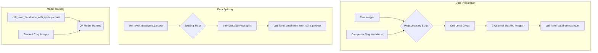

# QA Model Data Preparation and Splitting Strategy

For the Quality Assurance (QA) model, a specific data preparation and splitting strategy is required to ensure valid, reproducible results.

### 1. Data Preparation: From Whole Images to Cell Crops

The QA model is trained at the cell level, not the whole-image level. A preprocessing script is used to convert the raw images and competitor segmentations into a dataset suitable for training.

This script performs the following steps:
1.  It iterates through every competitor segmentation for every raw image.
2.  For each individual cell in a segmentation, it calculates a bounding box (e.g., 64x64 pixels).
3.  It uses this same bounding box to create two corresponding image crops: one from the **raw image** and one from the **competitor's segmentation mask**.
4.  These two crops are **stacked into a single, 2-channel image file** and saved. This stacked image is the direct input for the QA model.
5.  A `cell_level_dataframe.parquet` file is generated to hold the metadata for every stacked crop.

The resulting dataframe has the following structure:

| `cell_id` | `stacked_crop_path` | `original_image_key` | `competitor` | `cell_jaccard` |
| :--- | :--- | :--- | :--- | :--- |
| 00001 | `data/cell_crops/00001.tif` | `BF-C2DL-HSC/01` | `competitor_A` | 0.92 |
| 00002 | `data/cell_crops/00002.tif` | `BF-C2DL-HSC/01` | `competitor_B` | 0.65 |
| ... | ... | ... | ... | ... |

### Dataflow Diagram



### 2. Data Splitting: Ensuring No Data Leakage

To create valid training, validation, and test sets, we must prevent data leakage. The golden rule is: **all cells that come from the same original source image must belong to the same split.**

The splitting process is as follows:
1.  Generate the `cell_level_dataframe.parquet` as described above.
2.  Get a list of all unique `original_image_key` values from the dataframe.
3.  Shuffle this list of keys using a fixed random seed.
4.  Split the **shuffled list of keys** into training, validation, and test sets (e.g., 70%/15%/15%).
5.  Create a new `split` column in the dataframe. Assign `'train'`, `'validation'`, or `'test'` to each cell based on which set its `original_image_key` belongs to.

### 3. Data Versioning with DVC

The final, split dataframe (`cell_level_dataframe_with_splits.parquet`) and the directory of stacked crop images are versioned with DVC.

```bash
dvc add data/cell_crops data/cell_level_dataframe_with_splits.parquet
git add .
git commit -m "feat: Create versioned QA dataset with splits"
```

This ensures that every experiment can be rerun on the exact same data by checking out the corresponding Git commit and running `dvc pull`.
